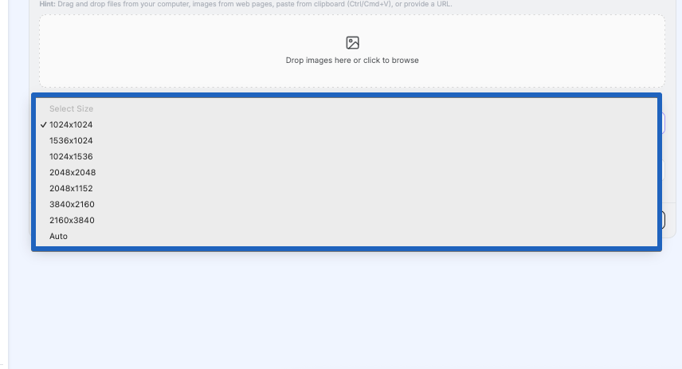
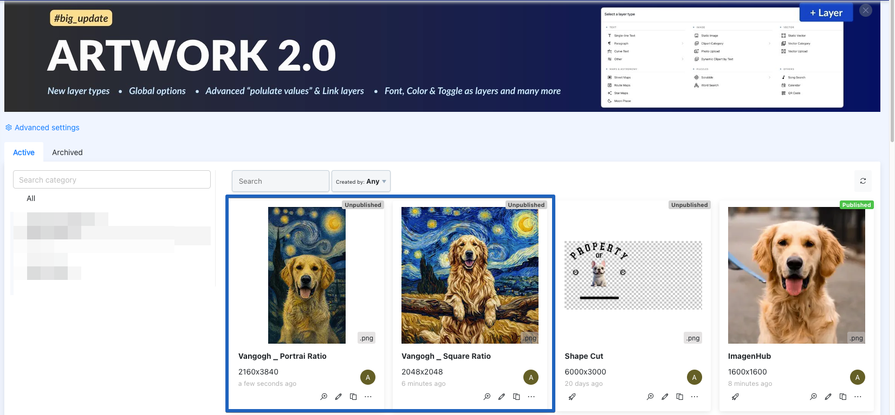
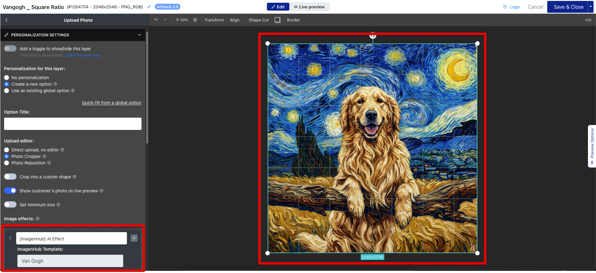

# Dynamic Upload Ratio

Normally a template is stuck with one aspect ratio. That's fine right up until you want to reuse it. Say you've built a lovely "Van Gogh" effect and you want it on a tall poster, a square avatar, and a wide banner — with a fixed ratio you'd end up cloning that template three times, once per shape. Tedious, and easy to get out of sync.

**Dynamic Upload Ratio** fixes that. Set a template's ratio to **Auto**, and it stops caring about shape ahead of time. Instead, it takes its shape from whatever image you feed it. One template, any ratio.

## When to use it

Auto is for when the *same* generation should come back in the shape of whatever went in.

The clearest example is a reusable Teeinblue template: one ImagenHub effect shared across a whole library of artworks and layers that are all different sizes — portrait here, square there, something wide over there — without building a separate template for each one.

If you actually *want* a template to always spit out one fixed shape, don't use Auto. Leave it on a concrete ratio. Auto is entirely opt-in, and turning it on for one template changes nothing about the rest.

## How it works

For any model whose ratio (or size) comes from a fixed list, that list now has one extra entry at the bottom: **Auto**.

Choose **Auto** and the shape decision moves out of the template and onto the image you send:

1. The image's own width and height come along with the request.
2. ImagenHub looks at those dimensions and picks the **closest ratio the model actually offers**. Orientation always holds — feed it something wide and you get something wide back, never a surprise flip to portrait.
3. That resolved ratio is what gets generated.

A few things that are handy to know:

- **It snaps to the nearest option, it doesn't invent one.** A model only knows the ratios in its list, so an odd size like 1000 × 1010 lands on the closest match (a square, here) rather than throwing an error.
- **No dimensions? No problem.** If nothing about size comes through, Auto quietly falls back to the model's own default ratio and carries on.
- **Your fixed-ratio templates are safe.** Anything pinned to a real ratio keeps behaving exactly as it always has.

::: tip A concrete ratio always beats Auto
If a template pins a real size instead of Auto, that size wins and the incoming shape is ignored. So if an Auto template keeps handing you squares, the first thing to check is that it's really set to **Auto** and not a fixed size.
:::

## Using it with Teeinblue

This is really what Auto was built for. A Teeinblue artwork library is full of layers at all sorts of sizes — a 2160 × 3840 portrait, a 2048 × 2048 square, a 1600 × 1600 print — and any of them might lean on the same ImagenHub effect.

With Auto, they can all share **one** template — no per-shape duplicates to maintain. The shape each generation comes back in is decided by the layer you set up, not the template.

The important part is that you still set the ratio yourself, once, on the layer. In the Teeinblue artwork editor, create a **Photo Upload** layer at the ratio you want that artwork to be — a tall layer for a portrait piece, a square one for a square piece. Then open its personalization settings and attach your ImagenHub template under **ImagenHub Template**.

From there it's automatic. When a customer uploads their own photo into that layer, Auto snaps it to the nearest ratio the model supports for that layer's shape — so whatever they upload comes out matching the artwork. You build the layer at the right ratio once; every customer's upload falls into line after that.

## Good to know

- **The old meaning of `auto` is gone.** On a couple of models `auto` used to mean "let the provider pick." It now means "match the shape I sent." Hardly anyone was using the old behaviour, so it was retired rather than kept around to confuse things.
- **Raw-dimension models are a different story.** Some models take a free-form width and height with no ratio list at all. There's no shape option for Auto to hook into on those, so the dimensions you send simply *are* the output size.

## Next steps

- [Templates](./templates.md) — how reusable presets store their inputs.
- [Image Generation](./image-generation.md) — the flow Auto plugs into.
- [Teeinblue Integration](../teeinblue/) — connecting ImagenHub templates to Teeinblue layers.
