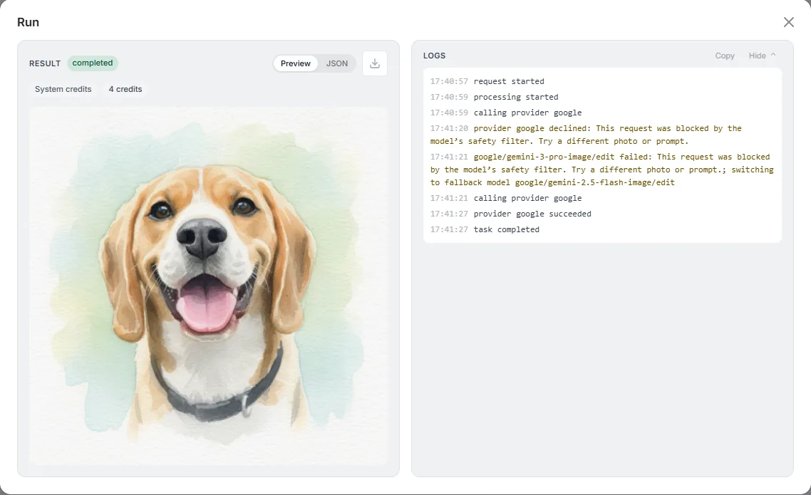
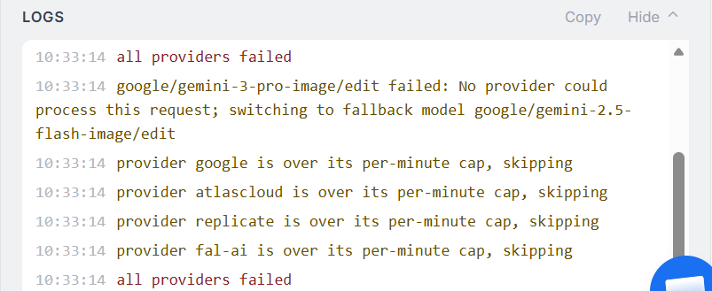
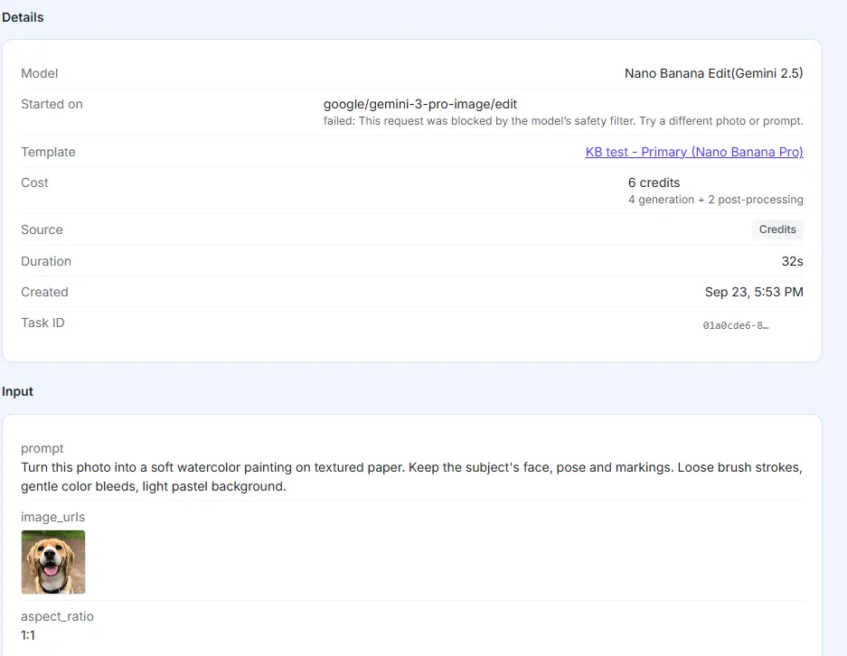
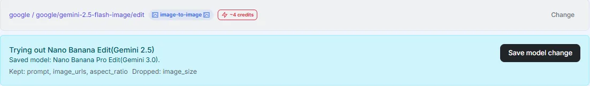
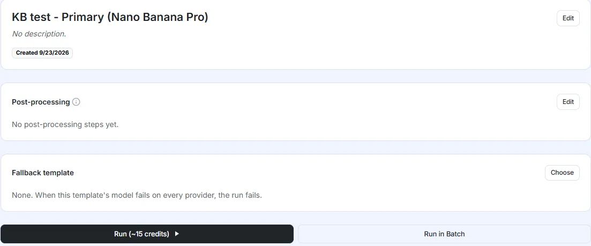
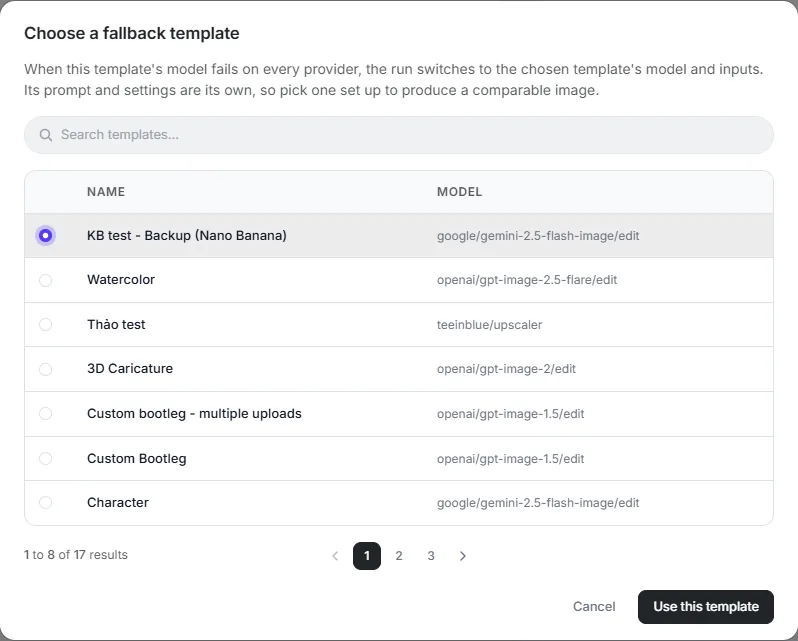
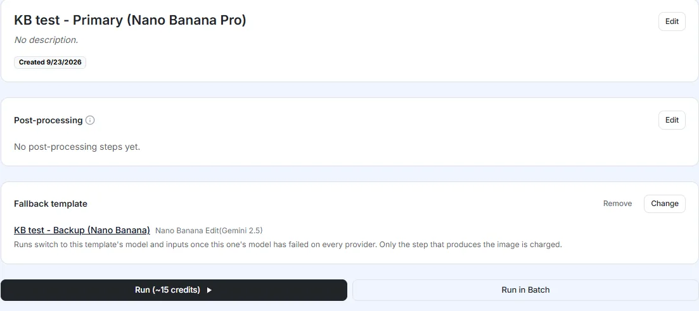
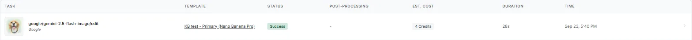

# Fallback Template

A template is tied to one model. But models have bad moments: a provider goes down, a photo gets rejected by the model's safety filter, or the model answers without returning a usable image. When that happens the run fails, and if the template sits behind a live storefront, every customer who tries it hits the same wall until someone edits the template by hand.

**Fallback template** is your backup plan. You pick a second template, built on a different model, and bind it to the first one. If the first template's model fails, ImagenHub automatically switches the run to the backup and still hands back an image.

## When to use it

- **Templates behind a live flow**: a storefront, or your own API integration. A failed run there usually means a customer who gives up.
- **Models with strict content filters**: some models reject certain kinds of photos more often than others. Pairing them with a model that handles those photos differently keeps the flow alive.
- **Models with only one provider**: if a model is only served by one provider, there is nothing for ImagenHub to rotate to when that provider has trouble. A fallback on a different model fills that gap.

If you would rather a run fail than come back looking different, skip the fallback. It is entirely opt-in, and a template without one behaves exactly as it always has.

## How it works

Every run starts on your template (the primary). The fallback only enters the picture once the primary has run out of options.

1. The run starts on the primary template, with its model and inputs.
2. ImagenHub tries that model on every provider available, the same provider rotation it has always done.
3. Only once the primary's model has failed on every provider does the run switch to the fallback template.
4. The run continues on the fallback template's model, prompt and settings.
5. If the fallback succeeds, you get its image. If it fails too, the run ends with an error. There is no third attempt.

### When does it switch?

| What happened on the primary | Switches to the fallback? |
| --- | --- |
| The model rejected the request under its safety policy (safety filter) | Yes |
| Provider error: server error, timeout, or rate limit on every provider | Yes |
| The model rejected the input, or responded without returning a usable image | Yes |
| Your account ran out of credits | No, the run fails right away |
| The primary succeeded | No, the fallback never runs |
| The template has no fallback set | No, the run fails as it always did |

::: tip Safety filter switches right away; a real provider error has to exhaust every provider first
When the model rejects a request under its safety filter, ImagenHub switches to the fallback right after the first attempt, without rotating through other providers. The log states the reason plainly: "This request was blocked by the model's safety filter...".

When a provider genuinely fails (server error, timeout, rate limit), ImagenHub tries every provider configured for that model in turn before concluding the model has "failed on every provider" and switching to the fallback. The log from a real test (forcing a rate limit across all 5 providers of the primary model) shows this sequence clearly, ending with a different reason entirely: "No provider could process this request".
:::

### What comes from where

Once a run switches, the second attempt uses almost everything from the fallback template. Images (the customer's input photo, reference images) follow a different rule: whichever field the original request already set a concrete value for is kept as-is, and only a field the request left unset falls back to the fallback template's own default. Post-processing always follows the primary template.

| Part of the run | Taken from |
| --- | --- |
| Model | Fallback template |
| Prompt | Fallback template (unless the original request explicitly sent its own prompt — see the note below) |
| Model settings (size or aspect ratio, quality, and so on) | Fallback template |
| Reference images | Follows the original request if it sent that field, otherwise the fallback template's own default (see the note below) |
| Input images sent with the request (for example a customer's upload) | Kept from the request as-is. Images already set in the fallback template are not used |
| Post-processing | The primary template. The fallback template's own post-processing does not run |

::: tip Reference images: decided per field, not "always taken from the fallback"
Whichever field the original request already sent a concrete value for — even one that happens to match the primary template's own default — is kept unchanged when the run switches to the fallback. Only a field the request never sent at all falls back to the fallback template's own default, not the primary's. Testing with three distinct `ref_urls` values sent explicitly in the request (equal to the primary's default, an arbitrary image, and equal to the fallback's own default) all showed the explicit value carried through; calling with a completely empty request (no fields set at all) showed every field, including the prompt and the input image, fall back to the fallback template's own defaults.

**Why this used to look like "always taken from the primary"?** When you click **Run** in the UI, ImagenHub always sends every field of the template explicitly, including ones you didn't change. So in everyday use through the UI, reference images will almost always be kept at whatever value the primary template currently has. Getting a field to genuinely fall back to the fallback template's default requires calling through the API/MCP and leaving that field out of the request entirely, which the Run button in the UI cannot do.
:::

::: warning The two models are not converted between each other
Different models describe image dimensions in their own way. One model uses `size: 1024x1536`, another uses `aspect_ratio: 2:3` plus `image_size: 2K`. ImagenHub does not convert one into the other, and it will not warn you if the two templates produce different shapes. Setting up both templates so their results are comparable is up to you.
:::

### What you pay

- The price you see before a run is the primary template's price. For example the **Run** button may read "~15 credits" even though the fallback only costs 4.
- You are only charged for the step that produced the image, at that step's price. If the fallback produced it, you pay the fallback template's price, which can be higher or lower than the primary's.
- A step that fails is never charged: it shows **0 Credits** in the Processing chain.
- If both steps fail, you pay nothing.
- The primary template's post-processing is still charged as normal, added on top of the price of whichever step produced the image.

::: tip See the real credit cost on the task page
The **EST. COST** column in Task history is only an estimate. The actual credits charged are on the **Cost** line in the task page's Details section.
:::

## Setting it up

1. **Build the backup template.** Go to Templates and click the Duplicate icon next to the template you want to protect. Open the copy, click **Change** next to the model name to pick a different model, then click **Save model change**. ImagenHub shows which inputs are kept and which are dropped because the new model doesn't support them.

   

   Rewrite the prompt and adjust the settings for the new model, click **Update**, give it a clear name, then run it a few times to make sure it produces something close enough to the original.

2. **Open the primary template.** In the right-hand column there is a **Fallback template** card. While nothing is bound it reads "None. When this template's model fails on every provider, the run fails." Click **Choose**.

   

3. **Pick the backup.** In the Choose a fallback template dialog, search for the template you just built, select it, and click **Use this template**. This dialog only lists templates you already own. To use a public template (one you don't already own) as a fallback, click **Import** on the Templates page, pick that public template to bring a copy into your own templates, then select that imported copy here.

   

That's it. The card now shows the fallback template's name and model. Click **Change** to swap it for another template, or **Remove** to go back to no fallback.

You can also set this up through the AI Assistant (MCP): the `create-template` and `update-template` tools accept a `fallback_template_id` parameter. This parameter accepts the ID of either a template you own or a public template, but only the ID of a template you own will actually run when the fallback fires; a public template needs to be imported first.

## Checking what happened on a run

In Task history, the **Task** column shows the model that actually ran, while the **Template** column still shows your original template. So a run on a Nano Banana Pro template that switched to Nano Banana is listed as `google/gemini-2.5-flash-image/edit` under the Nano Banana Pro template's name.

On the task page, a yellow notice reading **Switched to the fallback template** shows why the primary model failed and which model the run continued on. Below that:

- **Details**: the Model line is the model that ultimately produced the image; Started on is the primary template's model together with its failure reason.
- **Processing chain**: each attempt is its own Generate row, with its own status, error code and cost.
- **Input**: the fallback template's prompt and settings, together with the request's original input image.
- **Logs**: a line reporting that the primary failed and the run is switching to the fallback model.

If the fallback also fails, the task is marked **Error**. The red notice at the top is the fallback's error. The primary's failure reason is still shown in the yellow notice and on the Started on line, so you can see why each attempt failed.

## Good to know

- **One backup, one switch.** Each template can have one fallback, and a run switches at most once. If the fallback template also has its own fallback set, that fallback is not used when the fallback template fails — the run ends there.
- **The result will not match exactly.** A different model with a different prompt will produce a slightly different image. The goal is to deliver something good instead of nothing, not a pixel-perfect copy.
- **Duplicating keeps the fallback.** If you duplicate a template that has a fallback set, the copy points to that same fallback. Check the copy's Fallback template card afterward.
- **Any of your own templates can be the fallback.** To use a public template as your fallback, Import it into your own templates first (the Import button on the Templates page), then pick that imported copy. Testing showed that pointing directly at a public template's ID without importing it first saves without an error, but the fallback does not actually work when the run switches.

## Next steps

- [Templates](./templates.md) — how reusable presets store their inputs.
- [Models & Providers](./models-and-providers.md) — how provider rotation works within a model.
- [Rate Limits & Credits](./rate-limits.md) — how credits are counted.
