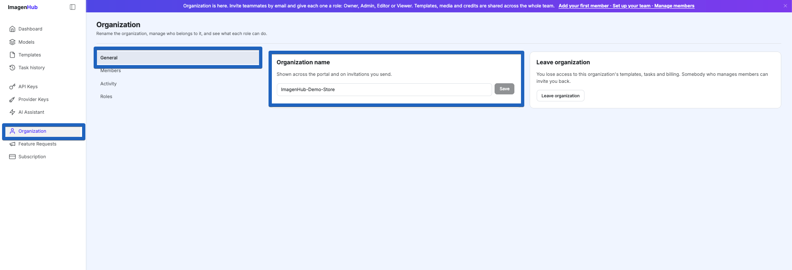
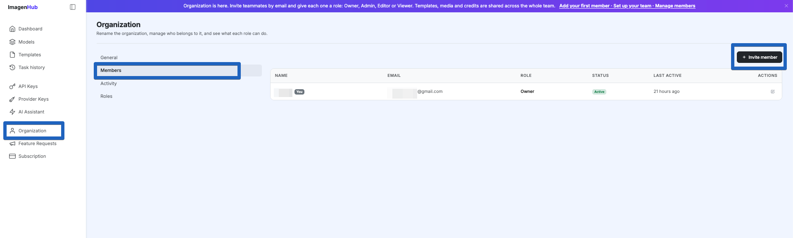
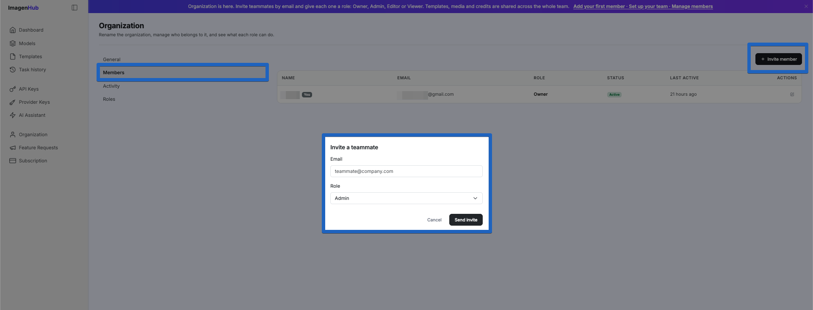
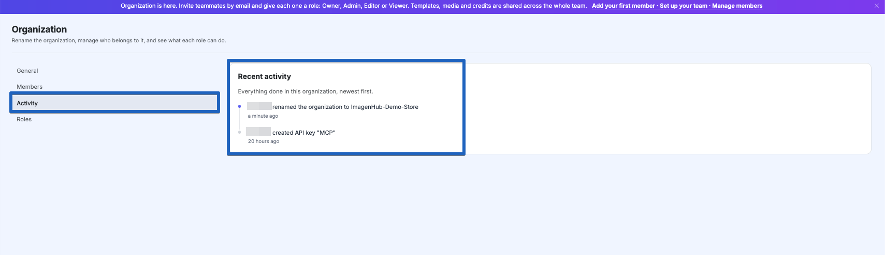
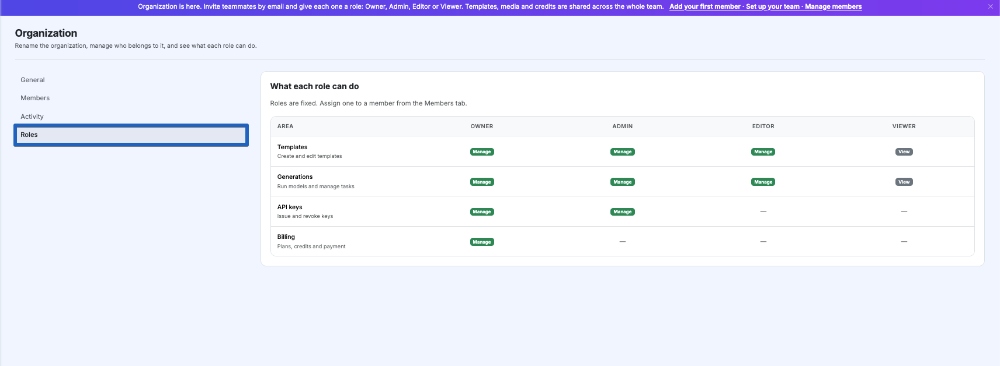

# Organization

Your Organization is the shared workspace that owns everything you create on ImagenHub — templates, generated media, credits, API keys, and provider keys — and lets you bring teammates in to work alongside you.

## What an organization is

When you sign up, ImagenHub automatically creates an organization for you. There's no separate setup step — you're already the **Owner** of your own org from day one.

Think of it this way:

- **Your account** is your login. On its own it doesn't own anything.
- **Your organization** owns the work: templates, media, credits, and keys all live here.
- **Roles** decide what each person can do inside the org.

The important consequence: everything you create belongs to the organization, not to you personally. If you invite teammates, they share the same templates, media, and credits. And if someone leaves the org, they lose access to what's inside it — there's no personal storage that follows an account around.

You reach all of this from the **Organization** link in the left sidebar. It has four tabs: **General**, **Members**, **Activity**, and **Roles**.

## General

The General tab is where you rename your organization.

The name you set here is shown across the portal and on any invitations you send, so it's worth naming it something your team will recognize. Type a new name and click **Save**.

This tab also has a **Leave organization** option. Leaving means you lose access to that org's templates, tasks, and billing — so only use it if you truly want out. (If it's your only organization, you'll be asked to create a new one afterward.)

## Members

The Members tab is your team roster. It lists everyone in the organization along with their **name, email, role, status, and when they were last active**.

### Inviting a teammate

Click **Invite member** in the top-right corner to bring someone in.

1. Enter their **email address**.
2. Pick the **role** they should have (Owner, Admin, Editor, or Viewer — see [Roles](#roles) below).
3. Click **Send invite**.

They appear in the roster right away as **Invited**, and an email goes out with a link that's valid for **7 days**. When they open it:

- If they've never used ImagenHub, they set a name and password, then land in the dashboard.
- If they already have a login, they go straight to the dashboard with their existing password.

A few things worth knowing:

- Email is matched loosely — `A@Gmail.com` and `a@gmail.com` are treated as the same person.
- You can't invite someone who's already in the org.
- You can **resend** an invite while it's still pending, but not once it's been accepted.
- The invite link is sensitive — anyone who has it can accept it, so don't forward it around.

Click any row to open that member's details, where you can review or change their role, or remove them.

## Activity

The Activity tab is a running log of what's happened in the organization, newest first.

It captures things like renaming the org, creating API keys, and other changes — a simple way to see recent actions at a glance without asking around.

## Roles

The Roles tab explains what each of the four roles is allowed to do. **Roles are fixed** — you can't create custom ones or change what a role can do — but you assign one to every member from the Members tab.

| Area | Owner | Admin | Editor | Viewer |
|------|-------|-------|--------|--------|
| **Templates** — create and edit templates | Manage | Manage | Manage | View |
| **Generations** — run models and manage tasks | Manage | Manage | Manage | View |
| **API keys** — issue and revoke keys | Manage | Manage | — | — |
| **Billing** — plans, credits and payment | Manage | — | — | — |

In plain terms:

- **Owner** — full control, including billing. Every org keeps at least one Owner.
- **Admin** — same as Owner, except they can't touch billing.
- **Editor** — can build and run templates and generations, but not keys or billing.
- **Viewer** — can look at templates and generated media, but can't create, run, or change anything.

One thing that's true for **everyone**, regardless of role: the **remaining credit balance is visible on the dashboard**. Editors and Viewers can see how much is left, they just can't top up or change the plan.

## Good to know

A few common questions:

- **Deleting an organization** isn't self-service — contact support if you need this.
- **Custom roles** aren't supported; the four roles above are fixed.
- **Templates can't be recovered after leaving an org** — they belong to the org, and access ends when your membership does.

## Next steps

- [Authentication](./authentication.md) — how API keys and logins work.
- [Templates](./templates.md) — the reusable presets your org shares.
