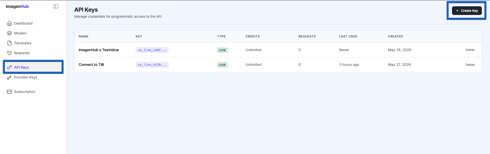
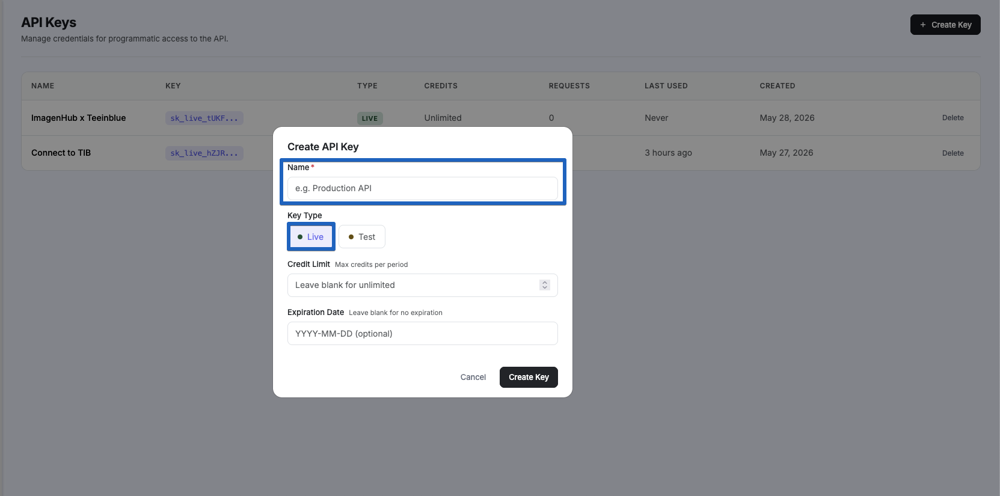
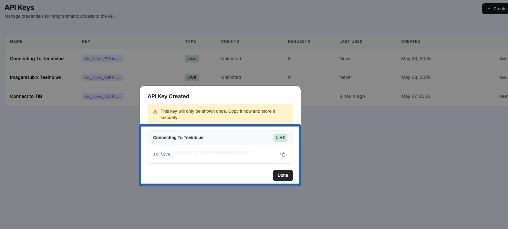
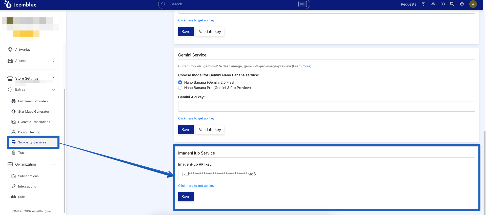

# Creating the API Keys

You must create an API key to connect ImagenHub to Teeinblue.

1. Go to your ImagenHub **Dashboard**.
2. Navigate to **API Keys** and click **Create Key**.

   

3. Fill in the necessary information.

   

   - Optionally set a **Credit Limit** or an **Expiration**.

4. Copy the key once you're done — it's shown only once.

   

5. In your Teeinblue Portal, go to **Extras → 3rd-party Services → GenAI Effect**, scroll down, and paste the API key.

   

That's it — ImagenHub is now connected to Teeinblue.

## Next

- [Manage your model access](/teeinblue/model-access) — pick BYOK or an ImagenHub subscription.
