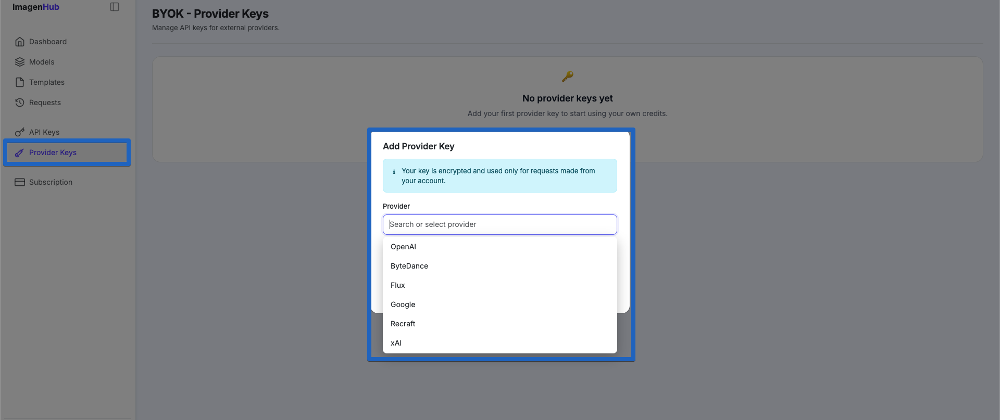
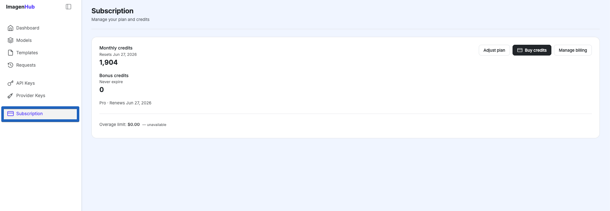

# Managing Your Model Access

You have two primary ways to power your AI features: using your own provider API keys, or subscribing to an ImagenHub plan.

## Bring Your Own Key

Link your personal provider API keys to maintain direct control over your usage, billing, and model preferences.

## ImagenHub Subscription

Opt for our subscription service to get instant, pre-configured access to our full library of models without needing to manage individual credentials.

## Built-in Fail-Safe

We prioritize your store's uptime. If you choose to use your own API key and it happens to run out of tokens or hit a usage limit, the system automatically falls back to our internal keys. This process is seamless, ensuring your customers can continue uploading images and generating designs without any service interruption.

## Next

- [Create your first template](/teeinblue/templates).
